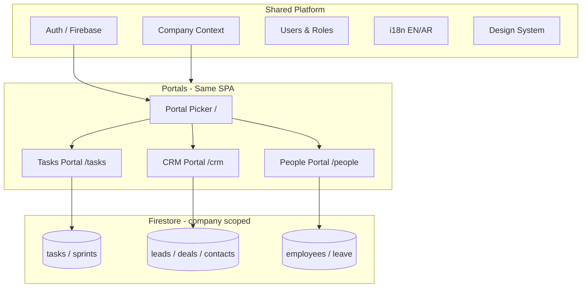

# Portal Architecture Plan

## D-Arrow Business — Multi-Portal Strategy

**Version:** 1.0  
**Date:** May 2026  
**Status:** Proposed  

---

## 1. Executive Summary

Transform D-Arrow Business from a **single app with a flat sidebar** into **three product portals** inside one codebase:

| Portal | Purpose | Default route |
|--------|---------|---------------|
| **Tasks** | Delivery, projects, sprints, work execution | `/tasks` |
| **CRM** | Sales pipeline, leads, deals, contacts | `/crm` |
| **People (HR)** | Employees, leave, approvals, timesheets | `/people` |

**Principles:**

- One login, one company, one Firebase project
- Shared auth, users, permissions engine, design system
- Separate UX shell, navigation, and dashboard per portal
- No separate repos or databases in Phase 1–3

This mirrors **Odoo apps** and **Zoho suite** without micro-frontend complexity.

---

## 2. Current State vs Target State

### Today

```
AppLayout
├── Sidebar (ALL modules mixed: Tasks + CRM + People + Analytics + Seed)
├── Header
└── Outlet
    ├── / → redirect /tasks/dashboard
    ├── /tasks/*     (no layout wrapper)
    ├── /crm/*       (CrmLayout ✅)
    └── /people/*    (no layout wrapper)
```

**Problems:**

- Users see modules they don’t use
- Home defaults to Tasks even for sales-only users
- CRM has sub-nav; Tasks and People don’t
- Permissions are module-level but UI doesn’t enforce portal boundaries
- “Tasks” exists in two places: `/tasks/*` (delivery) and `/crm/tasks` (sales follow-ups) — confusing without portal context

### Target

```
AppLayout (shell only: header + portal switcher + profile)
├── PortalPickerPage          /  or  /home
├── TasksLayout               /tasks/*
│   ├── Dashboard
│   ├── List / Board / Sprints
│   └── Task detail
├── CrmLayout (exists)        /crm/*
│   ├── Dashboard
│   ├── Leads / Deals / Contacts / CRM Tasks / Reports
│   └── Record detail pages
└── PeopleLayout              /people/*
    ├── Dashboard
    ├── Employees / Leave / Approvals / Timesheets / Performance
    └── Employee profile
```

---

## 3. Architecture Diagram



---

## 4. Portal Definitions

### 4.1 Tasks Portal (Delivery & Execution)

**Users:** PMs, developers, ops, anyone doing sprint work  

**Dashboard KPIs:**

- Open / in-progress / done tasks
- Current sprint progress
- Overdue tasks
- Tasks by assignee

**Navigation:**

| Route | Page |
|-------|------|
| `/tasks` | Dashboard |
| `/tasks/list` | Task list |
| `/tasks/board` | Kanban board |
| `/tasks/sprints` | Sprints |
| `/tasks/new` | Create task |
| `/tasks/:taskId` | Task detail |

**Not included:** CRM follow-up tasks (stay under `/crm/tasks`).

---

### 4.2 CRM Portal (Sales)

**Users:** Sales, managers, admins  

**Already built:** Leads, contacts, deals, pipeline kanban, reports, chatter, notifications.

**Navigation:** (existing `CrmSubNav`)

| Route | Page |
|-------|------|
| `/crm` | CRM dashboard |
| `/crm/leads` | Leads pipeline/list |
| `/crm/contacts` | Contacts |
| `/crm/deals` | Deals pipeline/list |
| `/crm/tasks` | Sales follow-up tasks |
| `/crm/reports` | Reports |

---

### 4.3 People Portal (HR)

**Users:** HR, managers, employees (self-service)  

**Dashboard KPIs:**

- Headcount / active employees
- Pending leave requests
- Pending approvals
- Timesheet status

**Navigation:**

| Route | Page |
|-------|------|
| `/people` | HR dashboard |
| `/people/employees` | Employee directory (optional rename from root) |
| `/people/leave` | Leave tracker |
| `/people/approvals` | Approvals |
| `/people/timesheets` | Timesheets |
| `/people/performance` | Performance |
| `/people/:id` | Employee profile |

---

## 5. Shared vs Portal-Specific

| Layer | Shared | Portal-specific |
|-------|--------|-----------------|
| Auth & session | ✅ | — |
| Company context | ✅ | — |
| User directory | ✅ | — |
| Firestore path prefix `companies/{id}/` | ✅ | Collection per domain |
| Layout shell (header) | ✅ | — |
| Sidebar / sub-nav | — | ✅ |
| Dashboard | — | ✅ |
| Permissions guard | Base roles | Portal access flags |
| Notifications | Global bell optional | Module events |
| Profile `/profile` | ✅ | — |

---

## 6. Routing Plan

### Phase 1 routes (no breaking changes)

```tsx
// New
{ index: true, element: <PortalPickerPage /> }  // replace redirect to tasks

// Wrap tasks
{
  path: "tasks",
  element: <TasksLayout />,
  children: [
    { index: true, element: <TasksDashboardPage /> },
    { path: "list", element: <TasksListPage /> },
    { path: "board", element: <TasksBoardPage /> },
    { path: "sprints", element: <SprintsPage /> },
    { path: "new", element: <TaskCreatePage /> },
    { path: ":taskId", element: <TaskDetailPage /> },
  ],
}

// CRM — keep as-is (already nested)

// Wrap people
{
  path: "people",
  element: <PeopleLayout />,
  children: [
    { index: true, element: <PeopleDashboardPage /> },
    { path: "leave", element: <LeaveTrackerPage /> },
    // ...
  ],
}
```

### Redirects for backward compatibility

| Old path | New path |
|----------|----------|
| `/tasks/dashboard` | `/tasks` |
| Keep `/tasks/list` etc. | Aliases or redirects |

---

## 7. Portal Switcher UX

**Location:** App header (next to logo or user menu)

```
[ Tasks | CRM | People ]   🔍 Search   🔔   👤
```

**Behavior:**

- Highlight active portal from URL prefix
- Filter visible portals by role (sales user may not see People)
- Persist last portal in `localStorage` (`d-arrow-last-portal`)
- After login → Portal Picker if user has access to 2+ portals; else auto-redirect to only portal

**Portal Picker (`/`):**

- Three cards with icon, title, short description, KPI teaser
- Role-based visibility
- “Continue where you left off” using last portal

---

## 8. Permissions Model

Extend existing role system:

```typescript
// src/lib/portal-permissions.ts
export const PORTAL_ACCESS = {
  tasks:  ["super_admin", "admin", "manager", "employee"],
  crm:    ["super_admin", "admin", "manager", "employee", "viewer"],
  people: ["super_admin", "admin", "manager", "employee"],
} as const;
```

**Guards:**

- `TasksLayout` → `TasksGuard`
- `CrmLayout` → `CrmGuard` (exists)
- `PeopleLayout` → `PeopleGuard`

**Sidebar rule:** Only render nav items for **current portal**, not global flat list.

---

## 9. Folder Structure (Feature-Based)

```
src/
├── app/
│   └── router.tsx
├── components/layout/
│   ├── app-layout.tsx          # Header + outlet (no global module sidebar)
│   ├── portal-switcher.tsx     # NEW
│   └── portal-picker-page.tsx  # NEW
├── features/
│   ├── tasks/
│   │   ├── components/
│   │   │   ├── TasksLayout.tsx      # NEW
│   │   │   ├── TasksSubNav.tsx      # NEW
│   │   │   └── TasksGuard.tsx       # NEW
│   │   └── pages/
│   ├── crm/                    # Already has layout
│   └── people/
│       ├── components/
│       │   ├── PeopleLayout.tsx     # NEW
│       │   ├── PeopleSubNav.tsx     # NEW
│       │   └── PeopleGuard.tsx      # NEW
│       └── pages/
└── lib/
    └── portal-permissions.ts   # NEW
```

---

## 10. What We Are NOT Doing (Yet)

| Idea | Decision | Reason |
|------|----------|--------|
| Separate Git repos per portal | ❌ Defer | Shared auth/data; high coordination cost |
| Separate Firebase projects | ❌ Never for same tenant | Breaks company-scoped data |
| Micro-frontends | ❌ Defer | Team size doesn’t justify |
| Fourth “Projects” portal | ⏸ Later | Fold into Tasks portal for now |
| `/analytics` global module | ⏸ Phase 4 | Move metrics into each portal dashboard first |

---

## 11. Cross-Portal Links

When linking across portals, use explicit paths:

| From | To | Link |
|------|-----|------|
| CRM lead | Delivery task | Future: optional link field |
| CRM deal | Contact | `/crm/contacts/:id` |
| People employee | User profile | `/profile` |
| Task | CRM record | Optional `entityType` + `entityId` on task |

Keep domains loosely coupled; deep integration is Phase 5+.

---

## 12. i18n

New namespace keys:

```json
// common.json
"portals": {
  "tasks": { "title": "Tasks", "description": "..." },
  "crm": { "title": "CRM", "description": "..." },
  "people": { "title": "People", "description": "..." },
  "switcher": "Switch app",
  "pickerTitle": "Choose workspace"
}
```

Arabic mirror in `ar/common.json`.

---

## 13. Success Metrics

- User lands on relevant portal within 1 click after login
- Sidebar items reduced by ~60% per session (only current portal)
- Zero cross-portal permission leaks in QA
- No regression on existing CRM / Tasks / People flows
- Lighthouse / bundle: optional code-split per portal route group

---

## 14. Risks & Mitigations

| Risk | Mitigation |
|------|------------|
| Broken bookmarks (`/tasks/dashboard`) | 301 redirects for 1 release |
| Duplicate “tasks” confusion | Rename UI: “Work Tasks” vs “CRM Tasks” |
| Large refactor of sidebar | Portal-scoped nav components |
| Employee-only users overwhelmed | Portal picker + role defaults |

---

## 15. Related Documents

| Document | Path |
|----------|------|
| Implementation roadmap (phases & tasks) | `docs/Portal-Implementation-Roadmap.md` |
| CRM user guide (Arabic) | `docs/CRM-دليل-النظام.md` |
| Portal plan (Arabic) | `docs/Portal-Architecture-Plan-AR.md` |
| CRM development roadmap | `CRM Development Roadmap.md` |

---

*End of Portal Architecture Plan*
